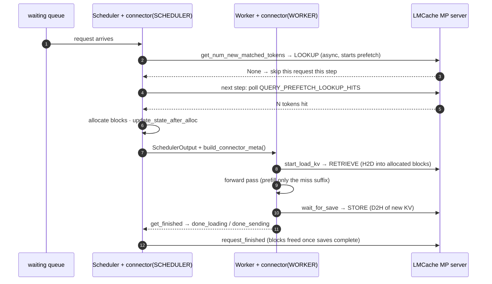

# How vLLM uses a KV connector

Source read: the venv's installed **vLLM 0.25.1**
(`/home/bo/lmcache/.venv/lib/python3.12/site-packages/vllm`). `file:line` refs point into
that tree; paths below are relative to the `vllm/` package root.

**The question this answers:** every recipe in `setup/` passes one JSON blob,
`--kv-transfer-config '{"kv_connector": "LMCacheMPConnector", ...}'`. What does vLLM do
with it — where does that string turn into cache lookups, loads and saves? This is the
vLLM-side half of the story; the LMCache-side half (what happens after the ZMQ message
leaves) is [code_structure/request_lifecycle.md](code_structure/request_lifecycle.md).

## The config JSON, field by field

```json
{"kv_connector": "LMCacheMPConnector",
 "kv_role": "kv_both",
 "kv_connector_extra_config": {"lmcache.mp.host": "tcp://localhost",
                               "lmcache.mp.port": 5556}}
```

| Field | Meaning |
|---|---|
| `kv_connector` | Name looked up in `KVConnectorFactory`'s registry (`distributed/kv_transfer/kv_connector/factory.py:27`; `LMCacheMPConnector` registered at `:171`) — picks *which* `KVConnectorBase_V1` implementation to instantiate. Lazy import: the lmcache package is only imported if this name is selected. |
| `kv_role` | `kv_both` = this instance both saves and loads. `kv_producer` / `kv_consumer` exist for prefill/decode disaggregation, where one instance only writes and the other only reads. |
| `kv_connector_extra_config` | Opaque pass-through dict — vLLM never interprets it, the connector class does. For LMCache MP: the ZMQ endpoint of the MP server. **Control-plane only**: KV bytes move via CUDA IPC, which is why `localhost` is structural, not a default (see [1_control_vs_data_plane.md](1_control_vs_data_plane.md)). |

Note what is **absent**: nothing about the model, its layer count, KV heads, dtype, or
chunk layout. All of that reaches LMCache later, automatically, via `REGISTER_KV_CACHE` at
worker startup — the config is identical across all four models in
[2_kv-cache-shapes.md](2_kv-cache-shapes.md) for exactly this reason.

## One name, two instances

vLLM instantiates the connector class **twice**, in different processes, with an explicit
role enum (`distributed/kv_transfer/kv_connector/v1/base.py:124`):

| Role | Created at | Lives in | May be used by |
|---|---|---|---|
| `SCHEDULER` | `v1/core/sched/scheduler.py:136` | scheduler (EngineCore) process | scheduling decisions only |
| `WORKER` | `ensure_kv_transfer_initialized` (`distributed/kv_transfer/kv_transfer_state.py:72`, role at `:92`) | each GPU worker process | forward pass / attention layers only |

The separation is deliberate and enforced — `factory.py::create_connector` (`:43`) carries
a comment saying the two are built separately "to enforce strict separation". The two
instances share **no state**. Their only communication channel is one-way and explicit:

```
scheduler connector --build_connector_meta()--> SchedulerOutput.kv_connector_metadata
                                                        |
                                (shipped with the step to every worker)
                                                        v
worker connector   <--bind_connector_metadata()-- model runner
```

The scheduler decides *what* should be loaded/saved; the metadata tells the workers; the
worker connector executes. Nothing flows back except completion signals (`get_finished`).

## Scheduler-side hooks (per scheduling step)

All call sites in `v1/core/sched/scheduler.py`:

| Hook | Called at | Purpose |
|---|---|---|
| `get_num_new_matched_tokens(request, n_local)` | `:739`, while scanning the waiting queue | "Beyond vLLM's own prefix cache hit, how many more tokens can you supply?" |
| `update_state_after_alloc(request, blocks, n)` | `:931`, right after block allocation | Tells the connector *which physical blocks* were allocated, so it knows the H2D destination |
| `build_connector_meta(scheduler_output)` | `:1138`, once per step, after all requests are scheduled | Packages the step's load/save work orders into `SchedulerOutput` |
| `request_finished(request, block_ids)` | `:2383`, when a request completes | Lets the connector delay block reuse if an async save is still reading those blocks |

### The three-value return contract

`get_num_new_matched_tokens` returns `(ext_tokens, load_kv_async)` and `ext_tokens` has
three meaningful states, handled at `scheduler.py:744`:

| Return | Meaning | Scheduler action |
|---|---|---|
| `None` | "Don't know yet — lookup still in flight" | pop the request, prepend to `step_skipped_waiting`, `continue` — **only this request** is skipped this step; everything else schedules normally |
| `0` | terminal miss | schedule a full prefill now |
| `N > 0` | terminal hit: N tokens available externally | allocate blocks for them; with `load_kv_async=True` the request parks in `WAITING_FOR_REMOTE_KVS` until the load lands |

The `None` state exists because the decision "how much to prefill" is made once and is
irreversible — blocks get allocated and the prefill schedule is fixed on it. Answering a
lookup takes the connector milliseconds; recomputing a 20k-token prefix takes seconds. So
vLLM prefers to re-ask next step rather than commit to a pessimistic answer.
`LMCacheMPConnector` exploits exactly this: the first call fires an async `LOOKUP` (which
also *starts the L2→L1 prefetch*) and returns `None`; later calls poll
`QUERY_PREFETCH_LOOKUP_HITS` until the answer is terminal.

### `request_finished`: a lease against in-flight D2H, not a cache-retention knob

Two facts that make this hook make sense:

- **vLLM's "free" is not "erase".** `_free_blocks` returns blocks to the pool but leaves
  their content and prefix-cache hashes intact; freed blocks stay hit-able until actually
  reallocated (LRU picks the victim). So "keep blocks around for reuse" needs no connector
  involvement — vLLM's own prefix cache already does it, and freeing early only makes the
  pool more flexible.
- **The connector's save is asynchronous and runs in another process.** `wait_for_save`
  only *submits* the STORE (ZMQ message + CUDA event) and returns; the MP server then
  DMA-reads those GPU blocks over CUDA IPC on its own time.

The race: if vLLM freed the blocks at request end, they could be reallocated to a new
request and overwritten *while the server's D2H is still reading them*. LMCache keys chunks
by token hash, so the result would be wrong bytes stored under valid keys — silent cache
poisoning (same failure flavor as the mamba step-alignment issue). vLLM cannot see the
external copy, so it asks instead:

```
_free_request (:2100)
  └─ _connector_finished (:2105) → connector.request_finished(request, block_ids) (:2383)
       returns delay_free_blocks: bool  → OR'd in (:2112); if True, skip _free_blocks (:2113)
...later steps...
worker connector.get_finished → reports req in finished_sending
  └─ _update_from_kv_xfer_finished (:2474) → _free_blocks (:2501)   # lease released
```

So the hold is a **lease**: "the external copy engine is still reading these blocks — don't
let anyone write, I'll signal when done." The lease is released by the one piece of
information that flows worker→scheduler (`finished_sending` via `get_finished`), and its
duration is one D2H (milliseconds) — as short as possible, since a held block is pure HBM
capacity loss. The API is general because PD-disaggregation needs the long form: a
`kv_producer`'s entire job is holding blocks until the decode side pulls them; LMCache's
`kv_both` just uses the shortest lease.

## Worker-side hooks (per forward pass)

Driven by `v1/worker/kv_connector_model_runner_mixin.py`:

| Hook | Called at | LMCache MP behavior |
|---|---|---|
| `bind_connector_metadata` | `:89`, before the forward | receive the scheduler's work orders |
| `start_load_kv(forward_context)` | `:95`, before attention runs | submit `RETRIEVE` over ZMQ + a CUDA IPC event; server DMAs L1→GPU |
| `wait_for_layer_load(layer)` / `save_kv_layer(layer, ...)` | per attention layer, from `model_executor/layers/attention/kv_transfer_utils.py:51` / `:57` | **no-ops** — MP mode transfers whole chunks, not layers; these exist for layerwise-pipelining connectors |
| `wait_for_save()` | `:71` / `:100`, after the forward | submit `STORE` over ZMQ + CUDA event; server DMAs GPU→L1 |
| `get_finished(finished_req_ids)` | `:103` | poll async transfer futures → `(done_sending, done_loading)` reported back to the scheduler |
| `clear_connector_metadata` | `:72` / `:112` | end of step |

There is even a degenerate path `kv_connector_no_forward` (`:36`): a step whose *only*
work is waiting on KV loads runs the connector hooks with no model forward at all.

## One request, end to end



Steps 2–5 are scheduler-time (cheap, control only); steps 8 and 10 are worker-time and are
where the actual bytes move — in the **server** process, via the CUDA IPC handles it got at
registration ([1_control_vs_data_plane.md](1_control_vs_data_plane.md)).

## Why this design is convenient for LMCache

- **Connector = policy, vLLM = mechanism.** vLLM owns block allocation, scheduling and the
  forward pass; the connector only answers "how many tokens can you supply" and moves KV
  into/out of blocks vLLM chose. LMCache never touches the scheduler's data structures.
- **The role split maps 1:1 onto LMCache's MP design**: the SCHEDULER instance is a thin
  ZMQ client doing lookups; the WORKER instance is a thin ZMQ client submitting transfers.
  Neither moves data — the MP server does, which is why profiling must target the server.
- **Model-agnostic attach**: because the shape/layout travels via `REGISTER_KV_CACHE` (real
  tensors + `engine_group_infos`), one connector config serves GQA, MLA+indexer, and hybrid
  mamba models alike ([2_kv-cache-shapes.md](2_kv-cache-shapes.md)). The only per-model coupling
  is the chunk-size rule enforced at registration (chunk % tokens_per_block == 0) and, for
  hybrid models, `validate_mamba_step_alignment`.

## See also

- [code_structure/request_lifecycle.md](code_structure/request_lifecycle.md) — the LMCache
  side of every hook above (5 phases, ZMQ requests, server handlers)
- [1_control_vs_data_plane.md](1_control_vs_data_plane.md) — why ZMQ carries none of the KV
- [2_kv-cache-shapes.md](2_kv-cache-shapes.md) — what the registered KV tensors look like for
  the four served models
