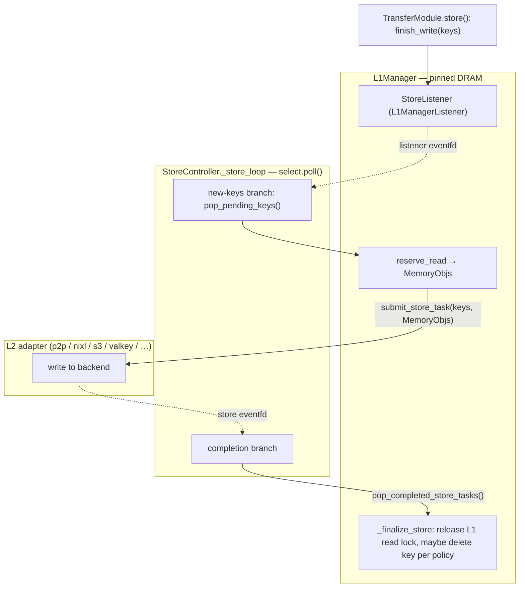
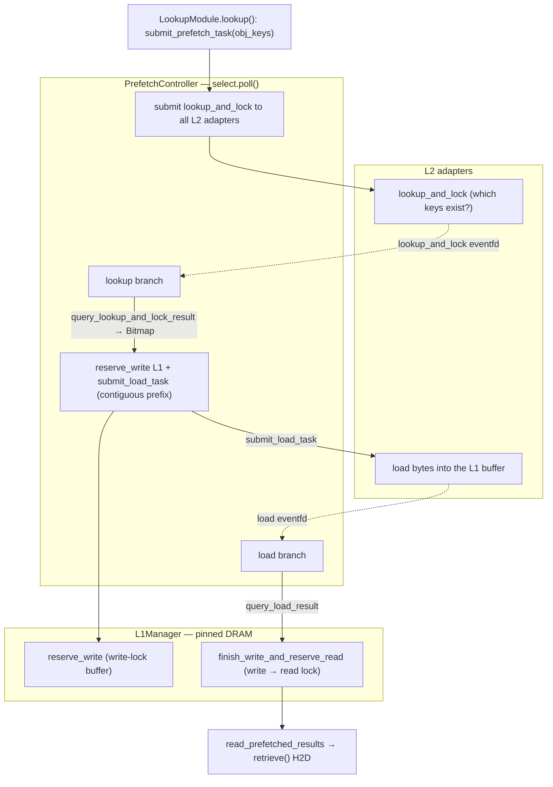

# Store & Prefetch controllers — how L1 and L2 move data

Traced against `/data1/bo/LMCache` @ `dev`, under `lmcache/v1/distributed/`. These two background
controllers are the halves of the storage manager that actually move bytes between **L1** (pinned
DRAM) and **L2** (the pluggable remote/external backends):

- **StoreController** flushes **L1 → L2** (persist newly stored KV).
- **PrefetchController** loads **L2 → L1** (stage hit KV so retrieve can H2D it).

Both are **event-driven, not busy-polling**: they run a `select.poll()` loop over eventfds —
one from the L1 side (new work) and one per L2 adapter (completion). Below, **solid arrows = calls
/ data flow**, **dotted arrows = eventfd notifications** (a wakeup, no payload).

The seam to the request lifecycle ([request_lifecycle.md](request_lifecycle.md)):
`store()` → `finish_write` **starts** the StoreController flush; `lookup()` → `submit_prefetch_task`
**starts** the PrefetchController load, whose result `retrieve()` later reads.

## StoreController — L1 → L2

`storage_controllers/store_controller.py`. Registers a `StoreListener` (an `L1ManagerListener`)
with the `L1Manager` (:254). When `finish_write` completes an L1 write, the listener queues the
keys and signals its eventfd; the loop wakes, reads the L1 buffers, and ships them to every L2
adapter; a second wakeup on the adapter's eventfd finalizes and frees the L1 slot.

**Steps, with file:line** (`store_controller.py` unless noted):

1. `__init__` registers the listener: `self._l1_manager.register_listener(self._listener)` (:254),
   and maps each adapter's store eventfd → adapter id via `get_store_event_fd()` (:295).
2. `StoreListener` (:70): on `on_l1_keys_write_finished`, enqueues keys and calls
   `self._event_fd.notify()` (:97). `get_event_fd()` (:85) exposes the fd; `pop_pending_keys()`
   (:99) drains the queue.
3. `_store_loop` (:429): `select.poll()` (:439) registers the listener eventfd (:442), a control
   eventfd (:443), and every adapter store eventfd (:446), then `poller.poll(timeout)` (:452).
4. New-keys branch: `pop_pending_keys()` (:469) → group by shape → `L1Manager.reserve_read` to
   pin the MemoryObjs → `_submit_store_for_single_shape` → adapter `submit_store_task`.
5. Completion branch: adapter store eventfd fires → `_drain_l2_store_completions` →
   `pop_completed_store_tasks()` → `_advance_request` (:491) / `_finalize_store` releases the L1
   read lock and, per policy, may delete the key from L1 (it now lives in L2).

## PrefetchController — L2 → L1

`storage_controllers/prefetch_controller.py`. Driven by `submit_prefetch_task` (issued from
`LookupModule.lookup`). It first asks every L2 adapter which keys it *has* (lookup-and-lock), then
reserves L1 write buffers and issues load tasks; on load completion it flips the L1 entry from
write-locked to read-locked so `read_prefetched_results` can serve the retrieve.

**Steps, with file:line** (`prefetch_controller.py` unless noted):

1. `__init__` maps eventfds: `get_lookup_and_lock_event_fd()` → adapter (:294) and
   `get_load_event_fd()` → adapter (:297), so one `select.poll()` covers all adapters' two phases.
2. `submit_prefetch_request` (:348) intakes the keys + layout, then submits
   `submit_lookup_and_lock_task` to every L2 adapter.
3. **Lookup phase:** adapter lookup eventfd fires → `query_lookup_and_lock_result` → a `Bitmap` of
   which keys that adapter holds. Only the **contiguous prefix** of found keys is kept (a hole
   truncates the prefix — no point loading past the first miss).
4. **Load phase:** `L1Manager.reserve_write` allocates write-locked L1 buffers, then
   `submit_load_task` tells the adapter to DMA/copy the bytes into those buffers.
5. Adapter load eventfd fires → `query_load_result` → `L1Manager.finish_write_and_reserve_read`
   atomically flips each entry from write-locked to **read-locked** (ready to read, pinned against
   eviction). `query_prefetch_result` (:425) / `wait_prefetch_result` (:452) let the caller poll.
6. Later, `retrieve()` calls `storage_manager.read_prefetched_results` on those read-locked L1
   objects and H2D-copies them to GPU, then `finish_read_prefetched` drops the read lock.

## The two interfaces both controllers speak

- **L1Manager** (`l1_manager.py`) — reference-counted slots with reserve/finish semantics:
  `reserve_read`/`finish_read` (StoreController), `reserve_write` + `finish_write_and_reserve_read`
  (PrefetchController). `register_listener` wires the `L1ManagerListener` callbacks that fire the
  store eventfd.
- **L2AdapterInterface** (`l2_adapters/base.py`) — a uniform async, eventfd-driven contract every
  backend implements: `get_store_event_fd` / `get_lookup_and_lock_event_fd` / `get_load_event_fd`
  for wakeups, and the submit/query pairs `submit_store_task`/`pop_completed_store_tasks`,
  `submit_lookup_and_lock_task`/`query_lookup_and_lock_result`,
  `submit_load_task`/`query_load_result`. Because it's one interface, p2p / nixl / s3 / valkey /
  bigtable / fs / dax / … all plug into the *same* two controller loops (this is where Part 2's L2
  backends attach).

## Why eventfd + poll (design note)

KV transfers are high-latency and bursty. A busy-poll loop would burn a core and add latency
jitter; blocking on a single fd couldn't watch L1 and N adapters at once. `select.poll()` over one
L1 eventfd + one eventfd per adapter lets a single background thread sleep until *some* side has
work, then service exactly that side — O(ready) wakeups, no spin. The `StorageManager`
([overview.md](overview.md) ③) owns both controllers and exposes only `reserve_write` /
`finish_write` / `submit_prefetch_task` / `read_prefetched_results` upward, hiding all of this.
