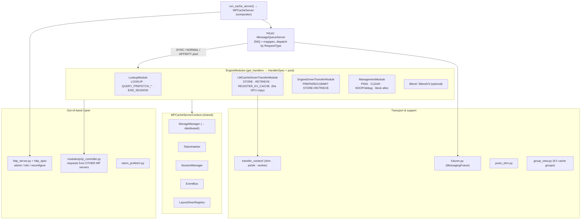

# MP server sub-modules — `lmcache/v1/multiprocess/`

Module-level map of the MP server (~16.7k LOC). This is the standalone process that runs the
H2D/D2H copy and serves requests from serving engines **and** other MP servers. For the request
flow through it see [request_lifecycle.md](request_lifecycle.md); for the L1/L2 controllers it
sits on top of, [controllers.md](controllers.md).

## Shape: a compositor of pluggable modules over a ZMQ queue

`server.py::MPCacheServer` holds **no business logic**. `_build_modules` (:164) assembles a list of
`EngineModule`s; each declares — via `get_handlers()` — which `RequestType`s it serves and which
thread pool each runs on (`engine_module.py::HandlerSpec` + `ThreadPoolType`). The
`mq.py::MessageQueueServer` receives ZMQ requests and dispatches each to the registered handler on
its pool. All modules share one `engine_context.py::MPCacheServerContext` (storage manager, token
hasher, session manager, event bus, layout registry).

Thread pools (`ThreadPoolType`): **SYNC** (short, must not block — e.g. register, ping),
**NORMAL** (general — e.g. lookup), **AFFINITY** (the CPU-pinned pool that runs the GPU copies —
store/retrieve), routed by `affinity_pool.py`.

## Sub-modules by role

### Server core
| File | Role |
|---|---|
| `server.py` | `MPCacheServer` compositor + `run_cache_server` entry point; `_build_modules` wires the module list |
| `engine_module.py` | `EngineModule` protocol, `HandlerSpec`, `ThreadPoolType` (SYNC/NORMAL/AFFINITY), `InstanceLivenessTarget` |
| `engine_context.py` | `MPCacheServerContext` — the shared state (storage manager, token hasher, session manager, event bus, layout registry) every module reads |
| `affinity_pool.py` | Thread pool with CPU-affinity routing; backs the AFFINITY pool the copy handlers run on |

### Transport (client ↔ server)
| File | Role |
|---|---|
| `mq.py` | ZMQ + msgspec message queue. `MessageQueueServer` dispatches Sync/Blocking/NonBlocking handlers; `MessageQueueClient` shares one singleton `ClientPollingLoop` across clients |
| `protocol.py` / `protocols/` | Wire protocol: `RequestType` enum, handler-type base classes, engine/blend protocol variants |
| `futures.py` | `MessagingFuture` — async result handle for an in-flight request |
| `transfer_context/` | Non-GPU transport contexts (`shm`, `pickle`, `worker_transfer`, `async_engine_driven`): register a worker's KV caches and move payloads that aren't direct GPU DMA |
| `posix_shm.py` | POSIX shared-memory primitives shared by the SHM transports |

### Handler modules (`modules/`)
| File | Role · handles |
|---|---|
| `modules/lmcache_driven_transfer.py` | **The GPU KV copy.** `store()` (D2H) / `retrieve()` (H2D) / `register_kv_cache`; runs on AFFINITY |
| `modules/engine_driven_transfer.py` | Alternate transport where the engine drives: `prepare/commit store+retrieve` |
| `modules/lookup.py` | `LookupModule` — prefix-hit lookup (submits the prefetch), prefetch polling, session lifecycle |
| `modules/p2p_controller.py` | `P2PController` — serves **other MP servers'** P2P requests (inter-node KV; annotated in PR #1) |
| `modules/management.py` | `ManagementModule` — ping / clear / debug / block-allocation reporting; also runs instance-reaper cycles |
| `modules/blend.py`, `modules/blend_v3.py` | Optional CacheBlend modules (pre-computed KV blending), enabled by config |
| `modules/server_transfer.py` | `TransferStrategy` (Pickle / Shm) for the non-GPU transfer paths |

### Session, hashing, prefetch helpers
| File | Role |
|---|---|
| `session.py` | `SessionManager` / `Session` — per-`request_id` token + chunk-hash cache, with expiry cleanup |
| `token_hasher.py` | Standalone chunk-hash computation (`compute_chunk_hashes`) — turns token ids into content-addressed chunk hashes |
| `group_view.py` | Engine-neutral description of a serving engine's KV cache groups (an *engine group* = one paged-block address space) |
| `warm_prefetch.py` | Warm-prefetch job table: load a caller-supplied key set L2→L1 ahead of demand |

### HTTP admin surface
| File | Role |
|---|---|
| `http_server.py` + `http_apis/` | FastAPI admin/info server (the `--http-port`): `cache_api`, `config_api`, `quota_api`, `reconfigure_api`, `info_api` — clear cache, query usage, hot-reconfigure L2 adapters |
| `cache_control/` | `ObjectService` + `key_resolver` + `prefetch_service`: node-local cache object ops (adapter listing, object listing, delete) wrapping the storage manager's L2 adapters |

## How a request reaches a module (one line)

`MessageQueueClient.submit_request(RequestType.X, payload)` → ZMQ → `MessageQueueServer` looks up
the `HandlerSpec` registered for `X` → runs `module.method(...)` on the declared thread pool →
result travels back as a `MessagingFuture`. The `RequestType` → module map:
`LOOKUP`/`QUERY_PREFETCH_*` → LookupModule; `STORE`/`RETRIEVE`/`REGISTER_KV_CACHE` →
LMCacheDrivenTransferModule; `PREPARE/COMMIT_*` → EngineDrivenTransferModule;
`PING`/`CLEAR`/`NOOP` → ManagementModule; `P2P_*` → P2PController.
