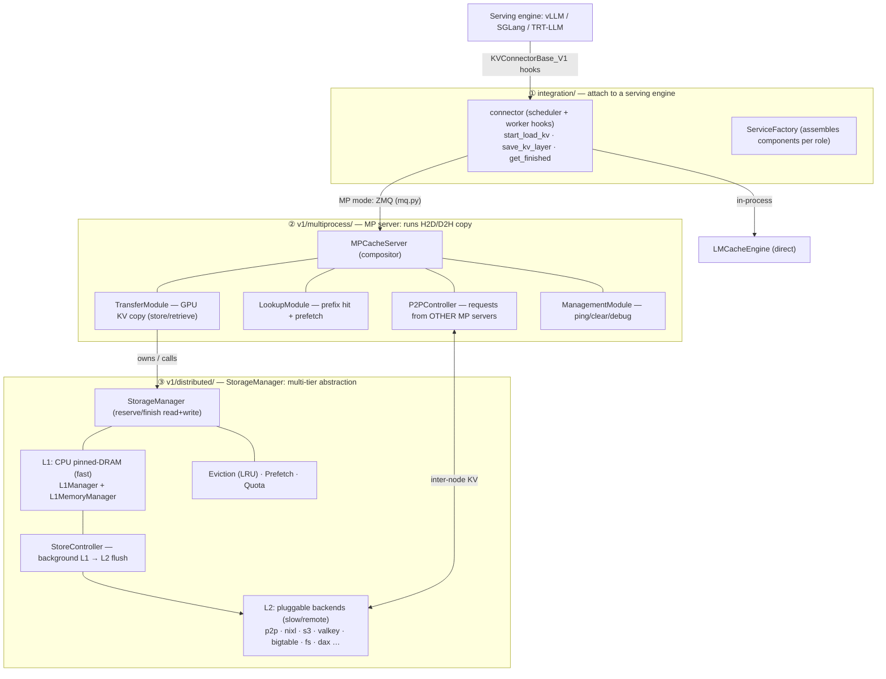

# LMCache high-level code structure

Source read: `/data1/bo/LMCache` @ `origin/dev` (local branch `feat/p2p-nvtx-annotations`, a
descendant of `dev`). Line counts and file names below reflect that tree.

This part maps the three **core modules** that a KV request flows through, top to bottom:

| Layer | Module | One line |
|---|---|---|
| ① Serving engine integration | `lmcache/integration/` | Plug LMCache into a serving engine (vLLM / SGLang / TRT-LLM) |
| ② MP server | `lmcache/v1/multiprocess/` | A standalone process that runs the H2D/D2H copy and serves requests from serving engines **and other MP servers** |
| ③ Storage manager | `lmcache/v1/distributed/` | A unified abstraction over a multi-tier (L1 DRAM → L2 remote) storage system |

One sentence: **a request enters from the serving engine (①), the MP server moves the KV
between GPU and CPU (②), and the multi-tier store it reads from / writes to is managed by the
storage manager (③).**

### Deeper dives

- [request_lifecycle.md](request_lifecycle.md) — how a request flows through LMCache in MP mode:
  vLLM lookup on the LMCache side, and how KV retrieve (H2D) / store (D2H) work. *(sequence diagram)*
- [controllers.md](controllers.md) — the Store & Prefetch controllers moving data L1↔L2, and how
  they interact with the L1 manager and L2 adapters via eventfd + poll. *(flow diagrams)*
- [mp_server.md](mp_server.md) — the MP server's sub-modules (compositor + pluggable modules over
  a ZMQ queue). *(component diagram)*
- [../1_control_vs_data_plane.md](../1_control_vs_data_plane.md) — what ZMQ carries and what it does
  **not**: the control/data plane split, and why each storage medium moves bytes its own way.
  *(repo root)*
- [../3_vllm_connector_usage.md](../3_vllm_connector_usage.md) — the vLLM side of ①: how vLLM turns
  `--kv-transfer-config` into two connector instances (scheduler + worker) and which hooks it
  calls when. *(repo root)*
- [../2_kv-cache-shapes.md](../2_kv-cache-shapes.md) — what the registered KV tensors look like for
  the four served models (GQA / hybrid mamba / MLA+indexer / MLA). *(repo root)*

## Layering

## ① Serving engine integration — `lmcache/integration/`

**Job: hook LMCache onto an inference engine.** For vLLM it implements vLLM's official
`KVConnectorBase_V1` interface and wires in the scheduler / worker lifecycle hooks:

- `get_num_new_matched_tokens` / `update_state_after_alloc` — **scheduler phase**: tell vLLM how
  many prefix tokens can be reused and adjust what it needs to compute.
- `start_load_kv` / `wait_for_layer_load` — **worker phase, H2D**: load matched KV into GPU.
- `save_kv_layer` / `wait_for_save` — **worker phase, D2H**: store freshly computed KV back.
- `get_finished` / `request_finished` — async completion / teardown.

**Two connectors, two deployment modes:**

- `vllm/lmcache_connector_v1.py` → `LMCacheConnectorV1Dynamic`: **in-process**, calls
  `LMCacheEngine` directly.
- `vllm/lmcache_mp_connector.py` (1436 lines, the largest) → `LMCacheMPConnector`: **MP mode** —
  moves no data itself; sends store/retrieve requests over ZMQ to a separate MP server.
  `LMCacheMPRequestTracker` tracks per-request scheduled/stored token counts and block allocation.

**Assembly via factory:** `base_service_factory.py::BaseServiceFactory` (abstract) →
`vllm/vllm_service_factory.py::VllmServiceFactory`. It decides, per role (scheduler vs worker),
which components to create (engine / lookup client / lookup server / offload server / metrics),
keeping the core decoupled from *which* serving engine is in use. SGLang and TRT-LLM have their
own adapters following the same pattern.

## ② MP server — `lmcache/v1/multiprocess/`

**Job: a standalone process that actually runs the H2D/D2H copy and serves requests from serving
engines and from other MP servers.** (This is the process Part 3 profiling identified as the one
that does the real KV copy in MP mode.)

**Architecture is compositor + pluggable modules.** `server.py::MPCacheServer` holds no business
logic; `_build_modules` plugs in a set of `EngineModule`s, and each declares — via
`get_handlers()` — which requests it serves and which thread pool it runs on
(`engine_module.py::HandlerSpec` + `ThreadPoolType`). Core modules:

| Module | File | Does |
|---|---|---|
| **LMCacheDrivenTransferModule** | `modules/lmcache_driven_transfer.py` | `store()` / `retrieve()` — **the real GPU KV copy**, batched per object group |
| **EngineDrivenTransferModule** | `modules/engine_driven_transfer.py` | alternate transport: prepare/commit store + retrieve |
| **LookupModule** | `modules/lookup.py` | prefix-hit lookup + prefetch polling + session lifecycle |
| **P2PController** | `modules/p2p_controller.py` | serves **other MP servers'** P2P requests (inter-node KV; the path annotated in PR #1) |
| **ManagementModule** | `modules/management.py` | ping / clear / debug / block-allocation reporting |

**Transport `mq.py`:** a ZMQ + msgspec message queue. `MessageQueueServer` dispatches to handlers
in three flavors — `Sync` / `Blocking` / `NonBlocking` (whether they may block a pool thread);
`MessageQueueClient` shares one singleton `ClientPollingLoop` across all clients.
`modules/server_transfer.py::TransferStrategy` provides two non-GPU transports, Pickle and Shm
(shared memory). `session.py::SessionManager` caches tokens and chunk hashes per request_id.

## ③ Storage manager — `lmcache/v1/distributed/`

**Job: wrap the multi-tier store behind one abstraction** so the layer above (the MP server) only
does read/write and never cares whether the bytes live in pinned DRAM or a remote S3.

**`storage_manager.py::StorageManager`** exposes `reserve_write` / `finish_write` /
`submit_prefetch_task` / `read_prefetched_results` / `unsafe_read`. Below it, two tiers:

- **L1 — local fast tier (CPU pinned DRAM).** `l1_manager.py::L1Manager` tracks object state;
  `memory_manager/l1_memory_manager.py::L1MemoryManager` is the pinned-DRAM allocator (over shm).
  Reads/writes use **reserve/finish + refcount + event_fd notify** semantics
  (`reserve_read` → `finish_read`) for concurrency safety.
- **L2 — slow / remote / external backends.** All implement one interface,
  `l2_adapters/base.py::L2AdapterInterface` (`submit_store_task` / `submit_load_task` /
  `submit_lookup_and_lock_task` / `query_*`, an event_fd-driven async API). Many backends,
  loaded on demand through the `l2_adapters/factory.py` registry: **p2p, nixl, s3, valkey,
  bigtable, fs, raw_block, dax, mooncake, aerospike, hfbucket, sagemaker…** (this is where Part 2
  L2 support lands).

**Background movement & governance:**

- `storage_controllers/store_controller.py::StoreController` runs a `_store_loop` that listens to
  `L1Manager` write-finished events (`StoreListener`) and asynchronously flushes keys L1 → L2.
  Siblings: `prefetch_controller`, `eviction_controller`.
- `eviction.py` + `eviction_policy/lru.py`: separate L1 and L2 eviction policies.
- `api.py::ObjectKey` is the content-addressed key (chunk hash + KV rank) threaded through all
  three layers.

## How this connects to earlier parts

- **Part 3**: the profiled H2D/D2H copy happens in ② `lmcache_driven_transfer.py`; the P2P path
  annotated in PR #1 is ② `p2p_controller.py` + ③ `l2_adapters/p2p_l2_adapter.py`.
- **Part 2**: the L2-support backends all live in ③ `l2_adapters/`.
- **"handles requests from other MP servers"** = ② `P2PController` ↔ ③ `p2p_l2_adapter`, the
  inter-node path.
