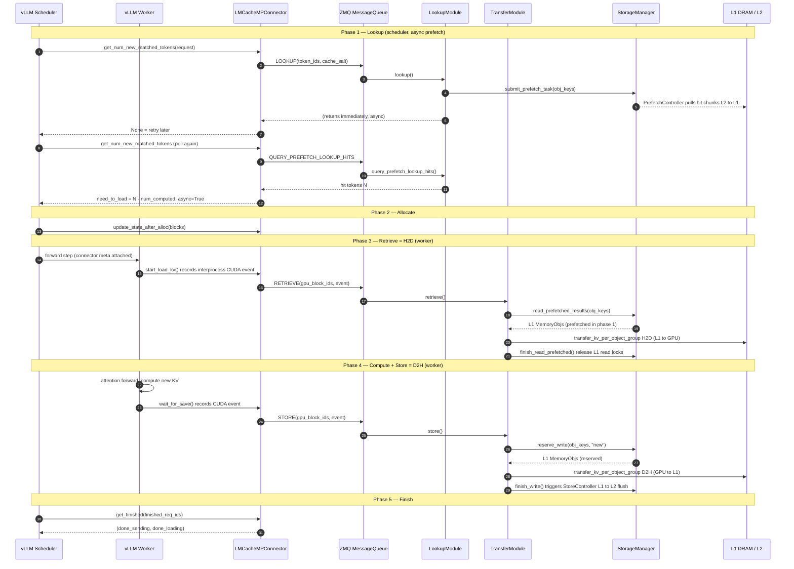

# Request lifecycle — how a request flows through LMCache (MP mode)

Traced against `/data1/bo/LMCache` @ `dev`. Scope = **MP mode** (the `LMCacheMPConnector` +
standalone MP server), the path Part 3 profiled. In-process mode differences noted at the end.

Two questions this answers:
1. **After a request enters vLLM, how does vLLM look up on the LMCache side?**
2. **How do KV-cache retrieve and store work?**

## The 5 phases

| Phase | vLLM hook (scheduler S / worker W) | ZMQ request | Server handler | Storage op |
|---|---|---|---|---|
| 1. Lookup | S `get_num_new_matched_tokens` | `LOOKUP` + `QUERY_PREFETCH_LOOKUP_HITS` | `LookupModule.lookup` / `query_prefetch_lookup_hits` | `submit_prefetch_task` (kicks L2→L1) |
| 2. Allocate | S `update_state_after_alloc` | — | — | (records block ids) |
| 3. Retrieve (H2D) | W `start_load_kv` | `RETRIEVE` | `TransferModule.retrieve` | `read_prefetched_results` → **H2D** |
| 4. Store (D2H) | W `wait_for_save` | `STORE` | `TransferModule.store` | `reserve_write` → **D2H** → `finish_write` |
| 5. Finish | W `get_finished` | (poll completions) | — | — |

Key insight up front: **lookup does not read KV — it starts a prefetch.** The lookup phase submits
a prefetch task that pulls hit chunks from L2 into L1 (pinned DRAM) in the background; the retrieve
phase then only does the final L1→GPU H2D copy from those prefetched buffers. So "lookup" and
"retrieve" are two halves of the load, split across scheduler time and worker time.

## Sequence diagram

## Phase-by-phase, with file:line

Client files under `lmcache/integration/vllm/`; server under `lmcache/v1/multiprocess/`.

### 1. Lookup — "how vLLM looks up on the LMCache side"

- vLLM scheduler calls `lmcache_mp_connector.py::get_num_new_matched_tokens` (:955). It is
  **async**: first call submits the lookup, later calls poll for the answer.
  - submit: `scheduler_adapter.maybe_submit_lookup_request(...)` (:992) →
    `vllm_multi_process_adapter.py` sends `RequestType.LOOKUP` (:756) over ZMQ.
  - poll: `scheduler_adapter.check_lookup_result(...)` (:998) → `QUERY_PREFETCH_LOOKUP_HITS`.
  - return contract: `None` = "not ready, ask again"; `0` = miss; `N` = N cached tokens →
    connector returns `(N - num_computed_tokens, async=True)`.
- Server `modules/lookup.py::lookup` (:206): hashes tokens
  (`token_hasher.compute_chunk_hashes`, :262), lays out chunk-major object keys
  (`_chunk_major_object_keys`, :318), then **`storage_manager.submit_prefetch_task(obj_keys, …)`**
  (:320) and registers a `_PrefetchJob` (:327) the scheduler polls.
  → This is where L2→L1 prefetch begins; see [controllers.md](controllers.md).

### 2. Allocate

- vLLM allocates paged blocks and calls `update_state_after_alloc` (:1027); the connector appends
  the newly allocated block ids to the per-request tracker (may be called twice for async loads).

### 3. Retrieve = H2D

- Worker `start_load_kv` (:764) records an **interprocess CUDA event** (:797) so the server can
  order its copy against vLLM's stream, then
  `worker_adapter.batched_submit_retrieve_requests(...)` (:800) → `RequestType.RETRIEVE`.
- Server `modules/lmcache_driven_transfer.py::retrieve` (:1144, `AFFINITY` pool): per object group,
  `storage_manager.read_prefetched_results(obj_keys)` (:1258, a context manager yielding the L1
  MemoryObjs prefetched in phase 1) → `transfer_kv_per_object_group(..., direction=H2D,
  batch_size=max_batch_size)` (:1267) → on the CUDA stream, `finish_read_prefetched(keys)` (:1288)
  to release the L1 read locks.
- The copy itself: `transfer_kv_per_object_group` (:411) calls `lmcache_memcpy_async_h2d` (:504).
- `wait_for_layer_load` (:804) is a no-op today (reserved for layer-by-layer pipelining).

### 4. Store = D2H

- `save_kv_layer` (:817) is a no-op; the real submit is deferred to `wait_for_save` (:838), which
  records a CUDA event (:863) and calls `worker_adapter.batched_submit_store_requests(...)` (:866)
  → `RequestType.STORE`.
- Server `store` (:932, `AFFINITY` pool): per object group,
  `storage_manager.reserve_write(obj_keys, layout_desc, "new")` (:1074) →
  `transfer_kv_per_object_group(..., direction=D2H, batch_size=1)` (:1090) → on success,
  `finish_write(keys)` on the CUDA stream (:1112).
- The copy: `lmcache_memcpy_async_d2h` (:570). `finish_write` fires the L1 write-finished event
  that wakes the StoreController to flush L1→L2 — see [controllers.md](controllers.md).

> **H2D vs D2H asymmetry (ties to Part 3, `11_h2d_d2h_copy_and_ideas.md`):** retrieve copies with
> `batch_size=max_batch_size` (batched H2D), store with `batch_size=1` (per-chunk D2H). Per-op the
> DMA favors store (D2H 56 GB/s vs H2D 32), but per wall-clock phase it **inverts**: batched
> retrieve keeps the copy engine at 88% duty cycle (28.7 GB/s effective), while store's per-chunk
> submission leaves it idle 84–86% of the time (8.8 GB/s effective) — the reserve/allocate cost
> (`batched_allocate`, 19–22% of NVTX range time) sits on store's critical path, between
> submissions. The `batch_size=1` constraint is an implementation limit of the batch splitter
> (`transfer_kv_per_object_group` whole-batch-skips on a `None` hole, :481-490), not a semantic
> property of store.

### 5. Finish

- `get_finished` (:893) → `worker_adapter.get_finished(...)` polls the async transfer futures and
  reports `(done_sending, done_loading)` back to the scheduler.

## Registration prerequisite (once per worker)

Before any store/retrieve, the worker adapter sends `RequestType.REGISTER_KV_CACHE`
(`vllm_multi_process_adapter.py::_send_register_kv_caches_request`, :1267) →
`lmcache_driven_transfer.py::register_kv_cache` (:834). This hands the server IPC handles to the
worker's GPU KV buffers + a transfer context (shm / pickle) so the **server process** can DMA
directly into/out of the worker's GPU memory. This is *why* the real H2D/D2H copy runs in the
server, not in vLLM (the Part 3 finding).

## In-process mode (contrast, one paragraph)

The `LMCacheConnectorV1Dynamic` connector (`lmcache_connector_v1.py`) skips ZMQ and the MP server
entirely: the same lookup / retrieve / store steps call an in-process `LMCacheEngine` directly, so
the H2D/D2H copy happens inside the vLLM worker process. The storage-manager layer below
([overview.md](overview.md) ③) is identical; only the transport and which process owns the copy
differ.
