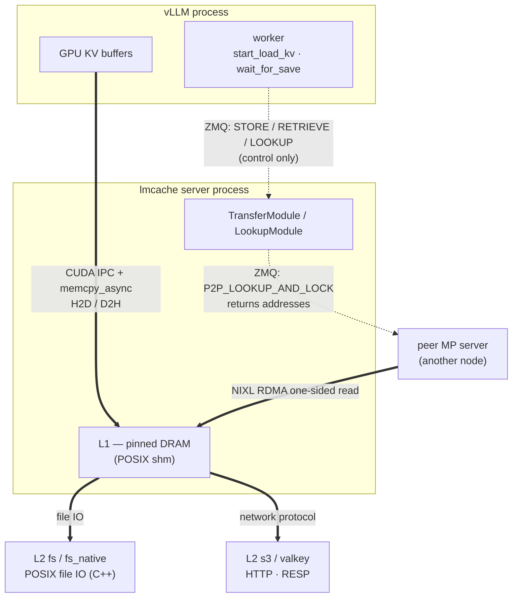

# Control plane vs data plane — what actually moves the KV

Source read: `/data1/bo/LMCache` @ branch `feat/p2p-nvtx-annotations` (descends from `dev`).
`file:line` refs point into that tree.

**The question this answers:** LMCache's MP mode talks over ZMQ. Does the KV cache itself travel
over ZMQ? And since KV lives on many different media (DRAM, local disk, S3, valkey, RDMA peers),
can one transport possibly suit all of them?

**Short answer: no, and it doesn't try to.** ZMQ carries *control messages only*. Every hop that
moves actual KV bytes uses a transport chosen for that medium, negotiated out-of-band. There is
exactly one exception, and upstream marks it a fallback.

## The two planes

| | Control plane | Data plane |
|---|---|---|
| Transport | ZMQ (DEALER↔ROUTER) + msgspec/msgpack | per-medium: CUDA IPC, shm, POSIX IO, HTTP, RESP, RDMA |
| Carries | "which keys, where, are they ready" | KV tensors |
| Message size | hundreds of bytes | MB–GB |
| Uniform across backends? | **yes** — one protocol for every L2 | **no** — deliberately |
| Where configured | `--host` / `--port` | `--l2-adapter` JSON, CUDA IPC handles |

This is the standard **out-of-band data transfer** pattern: a cheap uniform channel negotiates
metadata, then the bulk moves over the fastest path available. RDMA, GPUDirect and DPDK are all
built this way.



Dotted = ZMQ control messages. Solid/thick = actual KV bytes. **The two never share a link.**

## What ZMQ actually carries

The full wire vocabulary is the `RequestType` enum (`v1/multiprocess/protocols/base.py:26`) —
every one of these is metadata:

| Category | Requests |
|---|---|
| Registration | `REGISTER_KV_CACHE`, `UNREGISTER_KV_CACHE` |
| Transfer commands | `STORE`, `RETRIEVE` |
| Lookup | `LOOKUP`, `QUERY_PREFETCH_LOOKUP_HITS`, `FREE_LOOKUP_LOCKS` |
| Prefetch polling | `QUERY_PREFETCH_STATUS`, `WAIT_PREFETCH_STATUS` |
| Session | `END_SESSION` |
| Control | `CLEAR`, `GET_CHUNK_SIZE`, `PING`, `NOOP` |
| P2P (peer-to-peer) | `P2P_LOOKUP_AND_LOCK`, `P2P_QUERY_LOOKUP_RESULTS`, `P2P_UNLOCK_OBJECTS` |

A message is multipart (`v1/multiprocess/mq.py:322`):

```
[0] request_uid    — correlates the response back to a future
[1] request_type   — the enum above
[2..] payloads     — msgspec-encoded, count/type fixed per request_type
```

`get_payload_classes(request_type)` strict-validates the payload arity; a mismatch raises with
"likely caused by a version mismatch between the lmcache client and lmcache server" — which is why
client and server must run the same lmcache version.

## The data plane, hop by hop

| Hop | What moves the bytes | ZMQ involved? |
|---|---|---|
| vLLM GPU ↔ MP server | CUDA IPC handles + `lmcache_memcpy_async_h2d` / `_d2h` (`lmcache_driven_transfer.py:504` / `:570`) | only the "copy these keys" command |
| MP server ↔ L1 | POSIX shared memory (`v1/multiprocess/posix_shm.py`) — same physical pages, no copy | no |
| L1 ↔ L2 `fs` | Python POSIX file IO | no |
| L1 ↔ L2 `fs_native` | native C++ client `lmcache.lmcache_fs.LMCacheFSClient` (`fs_native_l2_adapter.py:147`) | no |
| L1 ↔ L2 `s3` | HTTP(S) | no |
| L1 ↔ L2 `valkey` / `resp` | RESP over TCP | no |
| L1 ↔ L2 `dax` / `raw_block` | mapped persistent memory / raw block device | no |
| L1 ↔ L2 `nixl` / `p2p` | NIXL RDMA (`v1/distributed/transfer_channel/impl/nixl_impl.py`) | metadata only |

Apart from `p2p_l2_adapter.py`, **no L2 adapter even imports `zmq`.**

`L2AdapterInterface` (`l2_adapters/base.py`) standardizes only the *call shape* — `submit_*` /
`query_*` pairs plus eventfd notification. It says nothing about transport. That is what "unified
abstraction over a multi-tier storage system" means here: uniform **control**, medium-specific
**data**.

## The clearest proof: the P2P adapter

`p2p_l2_adapter.py` is the one L2 adapter that uses ZMQ (`:24`, `:137` — a `MessageQueueClient`
pointed at `peer_mq_server_url`). Splitting what it sends where:

**Over ZMQ** — three metadata round-trips:

```
:232  P2P_LOOKUP_AND_LOCK       "do you hold these keys? lock them"
:269  P2P_QUERY_LOOKUP_RESULTS  "results?"          -> TransferChannelAddress per key
:294  P2P_UNLOCK_OBJECTS        "done, release"
```

**Over RDMA** — `submit_load_task` (`:306`):

```python
local_addresses = self._tc_context.get_transfer_channel_address(
    [(obj.shm_offset, obj.shm_byte_length) for obj in objects])
read_task_id = self._tc_client.submit_read(local_addresses, remote_addresses)
```

What came back over ZMQ was a `TransferChannelAddress` — **an address, not the data**. The bytes
then move by NIXL one-sided RDMA read, straight from the peer's memory into a local shm offset.
The KV never touches ZMQ.

## How the out-of-band channel gets established

`REGISTER_KV_CACHE` exists precisely to set this up, and it runs once per worker at startup:

1. vLLM worker: `vllm_multi_process_adapter.py:1262` → `_send_register_kv_caches_request` (`:1267`)
2. server: `lmcache_driven_transfer.py::register_kv_cache` (`:834`)

The worker hands over IPC handles to its GPU KV buffers plus a transfer context. From then on the
server can DMA **directly into vLLM's GPU memory** without routing anything through ZMQ.

Note the thread-pool assignment in `get_handlers` (`:776`) — it encodes the same split:

| Request | Pool | Why |
|---|---|---|
| `REGISTER_KV_CACHE` / `UNREGISTER_KV_CACHE` | `SYNC` | cheap, one-off setup |
| `STORE` / `RETRIEVE` | `AFFINITY` | CPU-pinned pool that runs the real GPU copies |

This is also why, in MP mode, profiling must target the **server** process (`NSYS_TARGET=server`):
the copy happens there, not in vLLM.

## The one exception

`PickleTransferStrategy` (`v1/multiprocess/modules/server_transfer.py:165`) really does put tensors
on the wire:

```python
def commit_store(self, key, instance_id, cpu_data: bytes, ...):
    chunks: list[torch.Tensor] = pickle.loads(cpu_data)
```

`cpu_data` arrives as a `COMMIT_STORE` payload — pickled tensors over ZMQ. Two qualifications:

1. It belongs to the **EngineDrivenTransfer** path, not the LMCacheDrivenTransfer path these
   harnesses use.
2. Upstream treats it as a fallback. `create_transfer_strategy` (`:37`) prefers shared memory and
   only degrades to pickle when SHM is unconfigured:

   ```python
   if shm_name and pool_size > 0:
       return ShmTransferStrategy(..., fallback_strategy=PickleTransferStrategy(...))
   return PickleTransferStrategy(storage_manager)
   ```

   `ShmTransferStrategy` sends a `ShmSlotDescriptor` — an address again.

So the instinct "ZMQ is wrong for bulk KV" is correct; the code agrees with it, which is why the
pickle path is the degraded mode rather than the default.

## Why the split is the right design

**ZMQ suits the control plane.** Control messages are small, frequent, and need request/response
correlation with async submission. DEALER↔ROUTER gives multiplexing, out-of-order replies,
auto-reconnect and framing for free. Crucially, control *should* be uniform: "look up these keys"
means the same thing whether the backend is S3 or an RDMA peer, so one protocol covering all
backends is a feature.

**ZMQ is wrong for the data plane, and isn't used there.** Bulk KV needs zero copy; ZMQ costs at
least two copies (user buffer → ZMQ internals → kernel) plus pointless msgpack framing. It cannot
address GPU memory, cannot issue one-sided RDMA, and cannot offload IO to a NIC or to C++ worker
threads.

Chunk-size makes the frequency concrete: at `chunk-size=16`, a 20k-token document is ~1250 chunks.
That is a lot of control messages — fine for ZMQ — and a lot of separate byte movements — which is
exactly why those go elsewhere. (Part 2/B measured the chunk-size effect: 16→256 cut L2 re-read
TTFT by 64 ms, −5.1%.)

## Empirical cross-check

If KV really moved over ZMQ, Part 3's nsys timeline would be dominated by socket syscalls and
memory copies. What actually dominates is `lmcache_memcpy_async_h2d` / `_d2h`, at **H2D ≈ 32 GB/s
and D2H ≈ 56 GB/s** — PCIe-bandwidth territory, which a loopback socket cannot reach. The
measurement independently rules out ZMQ as the data path.

## See also

- [vllm_connector_usage.md](vllm_connector_usage.md) — the vLLM side: how `--kv-transfer-config`
  becomes two connector instances and which hooks fire when
- [code_structure/overview.md](code_structure/overview.md) — the three core modules
- [code_structure/request_lifecycle.md](code_structure/request_lifecycle.md) — the 5 phases of one request
- [code_structure/controllers.md](code_structure/controllers.md) — Store/Prefetch controllers, L1↔L2
- [code_structure/mp_server.md](code_structure/mp_server.md) — MP server sub-modules
